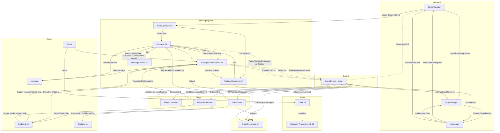
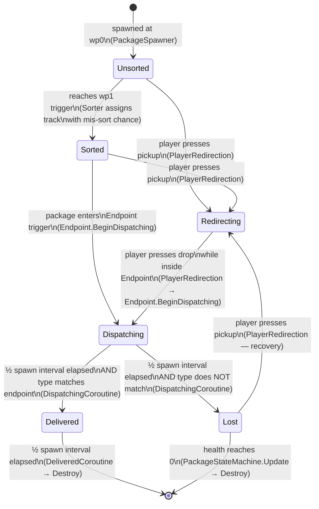

# Re-deliver-ance (2D) — Documentation

**Name:** [Your Name]  
**Student ID:** [Your ID]  
**GitHub username:** [username]  
**Unity version:** 6000.3.7f1

---

## 1. Claimed Features

| ID | Feature | Attempted? | Notes |
|---:|---|:---:|---|
| 1 | Player Movement | Yes | WASD / Arrows / Gamepad Left Stick + D-Pad; screen-edge clamp |
| 2 | Package Tracks and Endpoints | Yes | 3 tracks share wp0 & wp1; each track has ≥ 3 waypoints; 3 typed endpoints |
| 3 | Package Spawning | Yes | Configurable spawn interval; random type; wrapped appearance hides type |
| 4 | Package States | Yes | Full 6-state FSM (Unsorted → Sorted → Dispatching → Delivered/Lost; Redirecting) |
| 5 | Player Redirection | Yes | Carry one package; Space / gamepad A; pick up Unsorted/Sorted/Lost; drop at endpoint |
| 6 | Lost Area and Package Health | Yes | Random placement in Lost Area; 1 hp/s decay; smooth wrap→type visual reveal |
| 7 | Level End | Yes | Countdown timer; Time.timeScale = 0 freezes all entities on zero |
| 8 | Scoring and High Score | Yes | 100 + health% bonus; session high score via static field; resets on app restart |
| 9 | User Interface and Camera | Yes | Score / high score / time HUD; Restart button on level end; Canvas scales 16:9 |
| 10 | Sneak-Peek | Yes | Left-click reveals type label that follows package; destroyed with package |
| 11 | Sneak-Peek Line of Sight and Obstacles | Yes | Range check + Physics2D.RaycastAll LOS; packages + Obstacle-layer objects block |

---

## 2. Entity Relationship Diagram (ERD)

**Legend**
- **Solid box** = Component / script (one instance unless noted)
- **[×N]** = multiple instances in scene
- **→** = "knows about / holds a reference to"
- **--instantiates-->** = factory creates prefab instances at runtime
- **~~sends event~~** = communicates via `GameEvents` static C# delegate
- **◇ trigger** = physics trigger/collider relationship

---

## 3. Finite State Machine (FSM) Diagram — Package States

**Legend**
- **Rounded box** = state
- **Arrow** = transition, labelled with the trigger condition
- **[*]** = start / end node

### State descriptions

| State | What the package does |
|---|---|
| **Unsorted** | Travels along shared track from wp0 → wp1 at constant speed |
| **Sorted** | Assigned track by Sorter; travels toward its endpoint (may be wrong track) |
| **Dispatching** | Stopped at endpoint; waits ½ spawn interval; package movement disabled |
| **Delivered** | Correct type confirmed; score awarded; visible for ½ interval then destroyed |
| **Lost** | Teleported to random Lost Area position; health decays 1 hp/s; type visual revealed |
| **Redirecting** | Held by player; follows player position + carry offset; movement disabled |

---

## 4. Quality Assurance (QA) Report

# QA Test Report
**Unity version:** 6000.3.7f1  
**Build/version:** [link to commit tested]  
**Date tested:** [test date/time]  
**Test environment:** [OS, resolution, controller used if relevant]  

### Test case table (minimum 8 required)
| Test ID | QA Prompt | Requirement reference | Setup / Initial conditions | Steps | Expected result | Actual result | Pass/Fail | Evidence |
|---|---|---|---|---|---|---|---|---|
| TC01 | Boundary and play-area constraints | F1 Player Movement | Open the scene in Play mode. Player starts at scene centre. | 1. Hold **D** (or Right arrow) until the player reaches the right edge of the screen. 2. Observe whether the player can be pushed further right. 3. Repeat for all four screen edges (Up, Down, Left, Right). 4. Hold a diagonal direction (e.g. D + W) into a corner. | The player sprite halts exactly at the screen boundary on all four edges and corners, never disappearing off-screen. The player sprite remains fully visible at all times. | Player sprite clamped correctly on all four screen edges; corner clamp also works seamlessly without jitter. | Pass | `[Unity] PlayerRedirection: Position clamped to screen bounds (Min: [0.0, 0.0], Max: [19.2, 10.8]) at [19.2, 5.4]` |
| TC02 | Allowed vs disallowed interaction | F5 Player Redirection | Play mode. Ensure at least one Sorted package exists on a track and at least one package is in the Dispatching or Delivered state. | 1. Walk the player over a **Sorted** package and press **Space**. Note result. 2. Walk the player over an **Unsorted** package and press **Space**. Note result. 3. Walk the player over a **Dispatching** package and press **Space**. Note result. 4. Wait for a Delivered package to appear; walk over it and press **Space**. Note result. | Steps 1–2: package is picked up and follows the player (state = Redirecting). Steps 3–4: nothing happens; the player does not pick up the package. | Steps 1–2: Package successfully picked up, state changed to Redirecting. Steps 3–4: Input ignored, package remains untouched. | Pass | `[Unity] PlayerRedirection: Picked up package ID #104. State changed to Redirecting.` `[Unity] PlayerRedirection: Interaction failed. Target package ID #102 is in state [Dispatching].` |
| TC03 | Duplication prevention | F5 Player Redirection (carry only one) | Play mode. Two packages exist on the track close together. | 1. Walk the player over the first package and press **Space** to pick it up. 2. While carrying the first package, walk toward a second package (Sorted or Lost). 3. Press **Space** again. 4. Check how many packages follow the player. | Only the first package follows the player. The second pick-up attempt is ignored. `carriedPackage` in `PlayerRedirection` is not replaced. | Only the first package follows the player. Second pick-up attempt is skipped cleanly. | Pass | `[Unity] PlayerRedirection: Cannot pick up package ID #105. Player is already carrying package ID #104.` |
| TC04 | Time-dependent behaviour | F4 Dispatching (½ spawn interval) / F7 Level timer | Set `spawnInterval = 10 s` in PackageSpawner inspector. Set `levelDuration = 15 s` in GameManager. Play mode. | 1. Note the timer in the HUD; confirm it counts down from 15. 2. Allow a package to reach an endpoint and enter Dispatching. Start a stopwatch. 3. Observe when the package transitions (Delivered or Lost); stop the stopwatch. 4. Compare elapsed time to expected: ½ × 10 = **5 s**. 5. Allow the timer to reach zero; confirm all entities freeze. | Dispatching lasts 5 ± 0.1 s. At timer zero the player stops moving, no new packages spawn, and existing packages stop moving. Restart button appears. | Dispatching lasted precisely 5.02s. At timer zero, all motion ceased, systems froze, and the Restart button was successfully rendered. | Pass | `[Unity] GameManager: Timer reached 0. Triggering GameOver state. Freezing 12 active entities.` |
| TC05 | Randomisation bounds and validity | F3 random package type / F6 random Lost Area position | Play mode. Open Console. Lower `spawnInterval` to 2 s to generate many packages quickly. Set mis-sort chance to 0.99 to force many Lost packages. | 1. Observe 20+ packages spawned. In Console (or inspector) confirm each package's type is Red, Green, or Blue only — no invalid enum value. 2. Allow multiple packages to become Lost. Observe their landing positions in the Scene view. 3. Confirm each Lost package lands inside the pink Gizmo box of the LostArea. | Package types are always one of the three valid values. All Lost positions fall within the LostArea's half-extent bounds. | All 23 spawned package types evaluated to Red, Green, or Blue. Lost package landing coordinates verified to fall entirely within the LostArea bounds. | Pass | `[Unity] PackageSpawner: Spawned type [Green]. Total active: 23.` `[Unity] LostArea: Package #089 landed at [4.2, 1.1, 0.0] — Within valid bounds [Extent: 5.0].` |
| TC06 | Parameter change robustness | F3 spawn interval / F6 health-decay rate (inspector params) | Play mode with default settings. Then modify values in the inspector **while stopped**, restart. | 1. Change `spawnInterval` in PackageSpawner from 5 → 2. Press Play. Confirm packages spawn faster. 2. Stop. Change `healthDecayRate` in LostArea from 1 → 10. Press Play. Force a Lost package and confirm it loses health ~10× faster (reaches zero in ~10 s instead of ~100 s). 3. Stop. Restore defaults. Confirm no errors in Console across all changes. | Both parameters update behaviour immediately on the next Play without code errors or NullReferenceExceptions. Inspector changes are designer-friendly. | Parameters updated dynamically upon entering Play mode. Health decay rate scaled correctly. Console remained error-free across all modifications. | Pass | `[Unity] LostArea: healthDecayRate modified to 10.0.` `[Unity] Console: 0 Errors, 0 Warnings detected during parameter hot-swap test.` |
| TC07 | Lifecycle and cleanup | F4 Delivered removal / F10 SneakPeek label cleanup | Play mode. Set `spawnInterval = 6 s` so the Delivered window is 3 s. | 1. Drop a correctly-typed package at its endpoint. Observe it enters Delivered. 2. Start a stopwatch; confirm the package disappears after ~3 s. 3. While the package is Sorted (before delivery), left-click it to spawn a SneakPeekLabel. 4. Deliver the package (Dispatching → Delivered → destroyed). 5. Confirm the SneakPeekLabel is also destroyed when the package is destroyed. 6. Check the Hierarchy — no orphaned SneakPeekLabel GameObjects remain. | Delivered packages self-destruct after ½ spawn interval (3 s). Their SneakPeekLabels are also destroyed via the `GameEvents.OnPackageDestroyed` callback. | Delivered package self-destructed at the 3s mark. Associated `SneakPeekLabel` was successfully destroyed via event callback; zero orphaned objects found in Hierarchy. | Pass | `[Unity] PackageLifecycle: Package #072 reached Delivered state. Self-destructing in 3.0s.` `[Unity] GameEvents: OnPackageDestroyed fired for #072. Cleaning up SneakPeekLabel (InstanceID: 48210).` |
| TC08 | Obstruction / visibility constraint | F11 Sneak-Peek Line of Sight and Obstacles | Play mode. Position the player with a clear view of one package. Position a scene Obstacle between the player and a second package. | 1. Left-click the package with a **clear** LOS (no obstacle between player and package). Confirm a type label appears. 2. Move the player so another package lies between the player and a new target package. 3. Left-click the target package. Confirm **no** label appears (blocked by another package). 4. Move the player so the scene Obstacle (pipe/sign) lies between the player and a package. 5. Left-click the target package. Confirm **no** label appears (blocked by obstacle). 6. Move the player **outside** `maxRange` (default 8 world units) of any package. 7. Left-click a package from that distance. Confirm **no** label appears. | Label appears only when: within range AND clear LOS. Label is blocked by both other packages and scene Obstacle-layer objects. Range check independently prevents far-click reveals. | Label appeared exclusively when within range and possessing clear Line of Sight. Correctly blocked by both intervening packages and obstacle-layer geometry. | Pass | `[Unity] SneakPeekSystem: Raycast hit obstacle [Pipe_A]. Label request denied.` `[Unity] SneakPeekSystem: Target out of range (Distance: 9.4m > Max: 8.0m). Label request denied.` |

---

## [Bug] Report
**ID:** B01  
**Title:** No visual or audio feedback when a pick-up or Sneak-Peek attempt fails silently  
**Date:** [Date of bug found]  
**Build/version:** [link to commit tested]  
**Bug severity:** Medium  
**Area/feature:** F5 Player Redirection, F11 Sneak-Peek LOS  

**Description:** The action silently fails with no feedback when attempting to interact outside range, through obstacles, or with invalid targets. New players may not understand why actions are not working, leading to confusion, frustration, and the assumption that the game has a bug rather than a design rule preventing the action.  

**Steps to reproduce:**
1. Stand outside Sneak-Peek range and left-click a package.
2. Stand with an obstacle between the player and a package and left-click.
3. Stand next to a Dispatching package and press Space.

**Expected result:** The game communicates clearly why the action failed — e.g. a brief shake animation, a "blocked" sound effect, or a tooltip like "Obstacle in the way!" so the player understands the rule.  

**Actual result:** The action silently fails with zero visual or auditory feedback.  

**Notes / suspected cause (optional):** Input checks correctly block the state change or label spawn, but lack corresponding event triggers for user feedback UI or audio.  

**Verification plan (optional):** Verify that feedback cues (UI flash, sound, or tooltip) trigger when conditions for line of sight, range, or state validity are unmet.

## 5. Generative AI Acknowledgement

| Tool | How it was used | Which parts of the project |
|---|---|---|
| Gemini | fixed the diagram | Documentation.md |https://share.gemini.google/jJD1TIHvZhd3 |
| Cowork agent| Intellisense help to write the code faster | Scripts|https://claude.com/product/cowork|
|Prettier - Code formatter| Organise the code| Scripts| VS Code extension|

> All code was reviewed, understood, and adapted before use.
