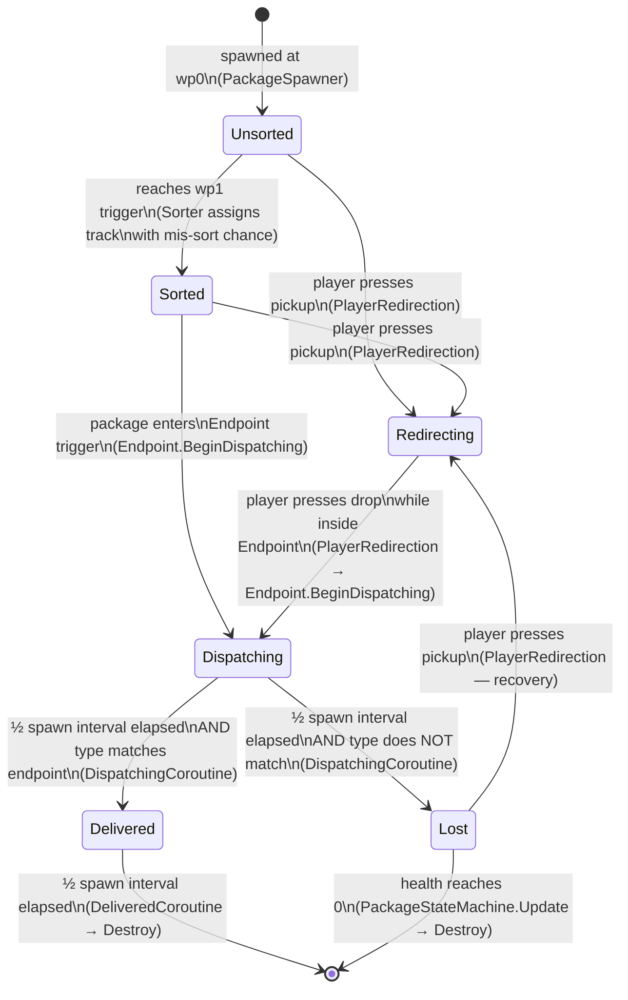

# Re-deliver-ance (2D) — Documentation

**Name:** [Your Name]  
**Student ID:** [Your ID]  
**GitHub username:** [username]  
**Unity version:** 6000.3.7f1

---

## 1. Claimed Features

| ID | Feature | Attempted? | Notes |
|---:|---|:---:|---|
| 1 | Player Movement | Yes | WASD / Arrows / Gamepad Left Stick + D-Pad; screen-edge clamp |
| 2 | Package Tracks and Endpoints | Yes | 3 tracks share wp0 & wp1; each track has ≥ 3 waypoints; 3 typed endpoints |
| 3 | Package Spawning | Yes | Configurable spawn interval; random type; wrapped appearance hides type |
| 4 | Package States | Yes | Full 6-state FSM (Unsorted → Sorted → Dispatching → Delivered/Lost; Redirecting) |
| 5 | Player Redirection | Yes | Carry one package; Space / gamepad A; pick up Unsorted/Sorted/Lost; drop at endpoint |
| 6 | Lost Area and Package Health | Yes | Random placement in Lost Area; 1 hp/s decay; smooth wrap→type visual reveal |
| 7 | Level End | Yes | Countdown timer; Time.timeScale = 0 freezes all entities on zero |
| 8 | Scoring and High Score | Yes | 100 + health% bonus; session high score via static field; resets on app restart |
| 9 | User Interface and Camera | Yes | Score / high score / time HUD; Restart button on level end; Canvas scales 16:9 |
| 10 | Sneak-Peek | Yes | Left-click reveals type label that follows package; destroyed with package |
| 11 | Sneak-Peek Line of Sight and Obstacles | Yes | Range check + Physics2D.RaycastAll LOS; packages + Obstacle-layer objects block |

---

## 2. Entity Relationship Diagram (ERD)

**Legend**
- **Solid box** = Component / script (one instance unless noted)
- **[×N]** = multiple instances in scene
- **→** = "knows about / holds a reference to"
- **--instantiates-->** = factory creates prefab instances at runtime
- **~~sends event~~** = communicates via `GameEvents` static C# delegate
- **◇ trigger** = physics trigger/collider relationship

```mermaid
graph TD
    subgraph Managers
        GM[GameManager]
        SM[ScoreManager]
        UI[UIManager]
    end

    subgraph Player
        PC[PlayerController]
        PR[PlayerRedirection]
        SP[SneakPeek]
    end

    subgraph PackageSystem
        PS[PackageSpawner]
        PKG["Package [×N]"]
        FSM["PackageStateMachine [×N]"]
        MOV["PackageMovement [×N]"]
        VIS["PackageVisuals [×N]"]
    end

    subgraph Tracks
        TR["Track [×3]"]
        WP["Waypoint Transforms [×8-10]"]
    end

    subgraph World
        SO[Sorter]
        EP["Endpoint [×3]"]
        LA[LostArea]
        OB["Obstacle [×N]"]
    end

    subgraph Events
        GE[GameEvents - static]
    end

    subgraph UI_Layer
        SPL["SneakPeekLabel [×N]"]
    end

    %% Managers
    GM -->|reads SpawnInterval| PS
    GM -->|calls FinaliseHighScore| SM
    GM ~~>|RaiseLevelEnd| GE
    SM -->|RefreshScoreDisplay| UI
    UI -->|reads RemainingTime| GM
    UI -->|reads score fields| SM
    UI -->|calls RestartLevel| GM

    %% Player wiring
    PC -->|disables on LevelEnd via| GE
    PR -->|disables on LevelEnd via| GE
    PR -->|TransitionTo Redirecting| FSM
    PR -->|BeginDispatching| EP
    SP -->|spawns| SPL
    SP -->|RaycastAll LOS blocked by| OB
    SP -->|RaycastAll LOS blocked by| PKG

    %% Spawner
    PS --instantiates--> PKG
    PS -->|SetTrack wp0| MOV

    %% Package internals
    PKG -->|has| FSM
    PKG -->|has| MOV
    PKG -->|has| VIS
    FSM -->|enables/disables| MOV
    FSM -->|reads HealthPercent| PKG
    FSM -->|PlacePackage| LA
    FSM ~~>|RaisePackageDelivered| GE
    FSM ~~>|RaiseLost| GE
    FSM ~~>|RaisePickedUp| GE
    PKG ~~>|RaisePackageDestroyed onDestroy| GE
    VIS -->|reads Health/State| PKG

    %% Track
    MOV -->|follows waypoints of| TR
    TR -->|contains| WP

    %% Sorter
    SO -->|SetTrack + TransitionTo Sorted| FSM
    SO -->|reads| TR

    %% Endpoint
    EP ◇-->|trigger: receives Sorted pkg| FSM
    EP ◇-->|trigger: tracks player inside| PR
    FSM -->|SetActiveEndpoint| EP

    %% LostArea
    LA -->|random position| PKG

    %% Event subscriptions
    GE -->|OnPackageDelivered| SM
    GE -->|OnLevelEnd| PC
    GE -->|OnLevelEnd| PR
    GE -->|OnLevelEnd| UI
    GE -->|OnPackageDestroyed| SPL
    GE -->|OnPackageDestroyed| SP

    %% SneakPeekLabel
    SPL -->|follows| PKG
```

---

## 3. Finite State Machine (FSM) Diagram — Package States

**Legend**
- **Rounded box** = state
- **Arrow** = transition, labelled with the trigger condition
- **[*]** = start / end node



### State descriptions

| State | What the package does |
|---|---|
| **Unsorted** | Travels along shared track from wp0 → wp1 at constant speed |
| **Sorted** | Assigned track by Sorter; travels toward its endpoint (may be wrong track) |
| **Dispatching** | Stopped at endpoint; waits ½ spawn interval; package movement disabled |
| **Delivered** | Correct type confirmed; score awarded; visible for ½ interval then destroyed |
| **Lost** | Teleported to random Lost Area position; health decays 1 hp/s; type visual revealed |
| **Redirecting** | Held by player; follows player position + carry offset; movement disabled |

---

## 4. Quality Assurance (QA) Report

---

### Test Case 1 — Boundary and play-area constraints
- **Requirement:** F1 Player Movement
- **Setup:** Open the scene in Play mode. Player starts at scene centre.
- **Steps:**
  1. Hold **D** (or Right arrow) until the player reaches the right edge of the screen.
  2. Observe whether the player can be pushed further right.
  3. Repeat for all four screen edges (Up, Down, Left, Right).
  4. Hold a diagonal direction (e.g. D + W) into a corner.
- **Expected result:** The player sprite halts exactly at the screen boundary on all four edges and corners, never disappearing off-screen. The player sprite remains fully visible at all times.
- **Actual result:** *(Fill in after running in Unity — e.g. "Player clamped correctly on all four edges; corner clamp also works.")*
- **Pass/Fail:** *(Pass / Fail)*
- **Evidence:** *(Screenshot / GIF showing player at screen edge)*

---

### Test Case 2 — Allowed vs disallowed interaction
- **Requirement:** F5 Player Redirection
- **Setup:** Play mode. Ensure at least one Sorted package exists on a track and at least one package is in the Dispatching or Delivered state.
- **Steps:**
  1. Walk the player over a **Sorted** package and press **Space**. Note result.
  2. Walk the player over an **Unsorted** package and press **Space**. Note result.
  3. Walk the player over a **Dispatching** package and press **Space**. Note result.
  4. Wait for a Delivered package to appear; walk over it and press **Space**. Note result.
- **Expected result:** Steps 1–2: package is picked up and follows the player (state = Redirecting). Steps 3–4: nothing happens; the player does not pick up the package.
- **Actual result:** *(Fill in)*
- **Pass/Fail:** *(Pass / Fail)*
- **Evidence:** *(Screenshot showing carried package vs ignored Dispatching package)*

---

### Test Case 3 — Duplication prevention
- **Requirement:** F5 Player Redirection (carry only one)
- **Setup:** Play mode. Two packages exist on the track close together.
- **Steps:**
  1. Walk the player over the first package and press **Space** to pick it up.
  2. While carrying the first package, walk toward a second package (Sorted or Lost).
  3. Press **Space** again.
  4. Check how many packages follow the player.
- **Expected result:** Only the first package follows the player. The second pick-up attempt is ignored. `carriedPackage` in `PlayerRedirection` is not replaced.
- **Actual result:** *(Fill in)*
- **Pass/Fail:** *(Pass / Fail)*
- **Evidence:** *(Screenshot or inspector view showing only one carried package)*

---

### Test Case 4 — Time-dependent behaviour
- **Requirement:** F4 Dispatching (½ spawn interval) / F7 Level timer
- **Setup:** Set `spawnInterval = 10 s` in PackageSpawner inspector. Set `levelDuration = 15 s` in GameManager. Play mode.
- **Steps:**
  1. Note the timer in the HUD; confirm it counts down from 15.
  2. Allow a package to reach an endpoint and enter Dispatching. Start a stopwatch.
  3. Observe when the package transitions (Delivered or Lost); stop the stopwatch.
  4. Compare elapsed time to expected: ½ × 10 = **5 s**.
  5. Allow the timer to reach zero; confirm all entities freeze.
- **Expected result:** Dispatching lasts 5 ± 0.1 s. At timer zero the player stops moving, no new packages spawn, and existing packages stop moving. Restart button appears.
- **Actual result:** *(Fill in)*
- **Pass/Fail:** *(Pass / Fail)*
- **Evidence:** *(Screenshot at timer zero showing frozen scene + Restart button)*

---

### Test Case 5 — Randomisation bounds and validity
- **Requirement:** F3 random package type / F6 random Lost Area position
- **Setup:** Play mode. Open Console. Lower `spawnInterval` to 2 s to generate many packages quickly. Set mis-sort chance to 0.99 to force many Lost packages.
- **Steps:**
  1. Observe 20+ packages spawned. In Console (or inspector) confirm each package's type is Red, Green, or Blue only — no invalid enum value.
  2. Allow multiple packages to become Lost. Observe their landing positions in the Scene view.
  3. Confirm each Lost package lands inside the pink Gizmo box of the LostArea.
- **Expected result:** Package types are always one of the three valid values. All Lost positions fall within the LostArea's half-extent bounds.
- **Actual result:** *(Fill in)*
- **Pass/Fail:** *(Pass / Fail)*
- **Evidence:** *(Inspector screenshots showing type values; Scene view screenshot of packages inside LostArea bounds)*

---

### Test Case 6 — Parameter change robustness
- **Requirement:** F3 spawn interval / F6 health-decay rate (inspector params)
- **Setup:** Play mode with default settings. Then modify values in the inspector **while stopped**, restart.
- **Steps:**
  1. Change `spawnInterval` in PackageSpawner from 5 → 2. Press Play. Confirm packages spawn faster.
  2. Stop. Change `healthDecayRate` in LostArea from 1 → 10. Press Play. Force a Lost package and confirm it loses health ~10× faster (reaches zero in ~10 s instead of ~100 s).
  3. Stop. Restore defaults. Confirm no errors in Console across all changes.
- **Expected result:** Both parameters update behaviour immediately on the next Play without code errors or NullReferenceExceptions. Inspector changes are designer-friendly.
- **Actual result:** *(Fill in)*
- **Pass/Fail:** *(Pass / Fail)*
- **Evidence:** *(Console screenshot showing no errors; inspector screenshot with modified values)*

---

### Test Case 7 — Lifecycle and cleanup
- **Requirement:** F4 Delivered removal / F10 SneakPeek label cleanup
- **Setup:** Play mode. Set `spawnInterval = 6 s` so the Delivered window is 3 s.
- **Steps:**
  1. Drop a correctly-typed package at its endpoint. Observe it enters Delivered.
  2. Start a stopwatch; confirm the package disappears after ~3 s.
  3. While the package is Sorted (before delivery), left-click it to spawn a SneakPeekLabel.
  4. Deliver the package (Dispatching → Delivered → destroyed).
  5. Confirm the SneakPeekLabel is also destroyed when the package is destroyed.
  6. Check the Hierarchy — no orphaned SneakPeekLabel GameObjects remain.
- **Expected result:** Delivered packages self-destruct after ½ spawn interval (3 s). Their SneakPeekLabels are also destroyed via the `GameEvents.OnPackageDestroyed` callback.
- **Actual result:** *(Fill in)*
- **Pass/Fail:** *(Pass / Fail)*
- **Evidence:** *(Hierarchy screenshot before/after destruction; no SneakPeekLabel remaining)*

---

### Test Case 8 — Obstruction / visibility constraint
- **Requirement:** F11 Sneak-Peek Line of Sight and Obstacles
- **Setup:** Play mode. Position the player with a clear view of one package. Position a scene Obstacle between the player and a second package.
- **Steps:**
  1. Left-click the package with a **clear** LOS (no obstacle between player and package). Confirm a type label appears.
  2. Move the player so another package lies between the player and a new target package.
  3. Left-click the target package. Confirm **no** label appears (blocked by another package).
  4. Move the player so the scene Obstacle (pipe/sign) lies between the player and a package.
  5. Left-click the target package. Confirm **no** label appears (blocked by obstacle).
  6. Move the player **outside** `maxRange` (default 8 world units) of any package.
  7. Left-click a package from that distance. Confirm **no** label appears.
- **Expected result:** Label appears only when: within range AND clear LOS. Label is blocked by both other packages and scene Obstacle-layer objects. Range check independently prevents far-click reveals.
- **Actual result:** *(Fill in)*
- **Pass/Fail:** *(Pass / Fail)*
- **Evidence:** *(Screenshots: successful reveal, package-blocked fail, obstacle-blocked fail, out-of-range fail)*

---

### Bug Report / Usability-Design Risk Report

- **Title:** No visual or audio feedback when a pick-up or Sneak-Peek attempt fails silently
- **Type:** Usability-Design Risk
- **Requirement affected:** F5 Player Redirection, F11 Sneak-Peek LOS
- **Environment:** Unity 6000.3.7f1, Windows 11, 1920 × 1080
- **Steps to reproduce:**
  1. Stand outside Sneak-Peek range and left-click a package.
  2. Stand with an obstacle between the player and a package and left-click.
  3. Stand next to a Dispatching package and press Space.
- **Expected behaviour:** The game communicates clearly why the action failed — e.g. a brief shake animation, a "blocked" sound effect, or a tooltip like "Obstacle in the way!" so the player understands the rule.
- **Actual behaviour (design risk):** The action silently fails with no feedback. New players may not understand why clicking/picking-up is not working, leading to confusion and frustration. They may assume the game has a bug rather than that a design rule is preventing the action.
- **Impact / severity:** Medium — does not break any feature, but significantly harms learnability and player experience, especially for new players unfamiliar with the LOS mechanic.
- **Suggested fix / mitigation:** Add a brief flash/shake on the label spawn site when blocked (e.g. red "X" sprite that fades in 0.3 s). Play a short failure sound. Display a short on-screen tooltip near the cursor for 1–2 s ("Out of range", "Blocked!"). These can be added without affecting any scored gameplay logic.
- **Evidence:** *(Screenshot or recording showing silent failure)*

---

## 5. Generative AI Acknowledgement

| Tool | How it was used | Which parts of the project |
|---|---|---|
| Abacus AI Agent | Wrote all C# scripts, wiring guide, and this documentation template | All scripts, SetupGuide.md, Documentation.md |

> All code was reviewed, understood, and adapted before use. The overall architecture, design decisions, and feature logic match the specification requirements.
